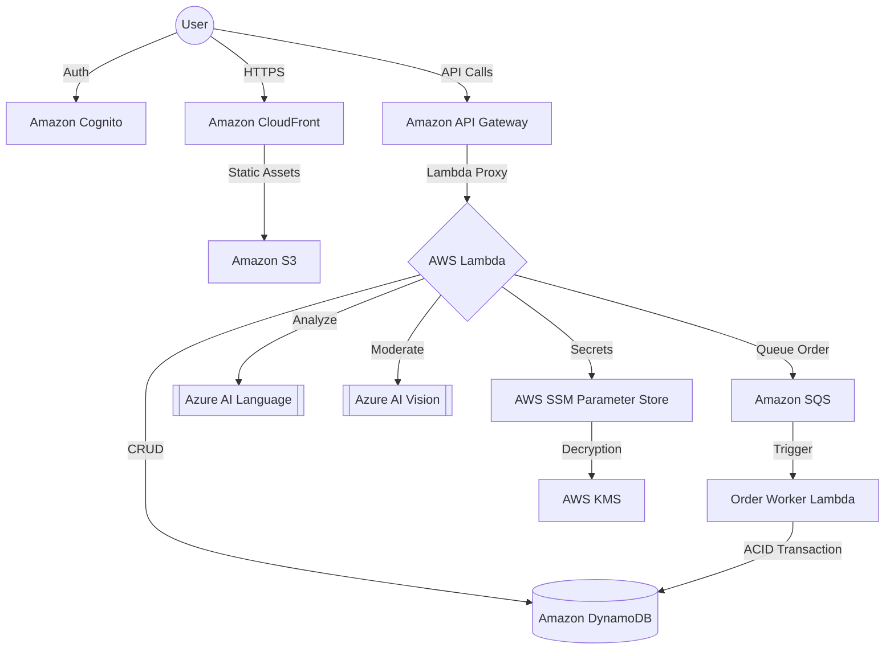

# ScholarKit: Enterprise-Grade Serverless E-Commerce Ecosystem
### CSD214 Cloud Computing | Final Project Submission | Shiv Nadar University

**ScholarKit** is a high-performance, multi-tenant cloud platform engineered for the automated procurement of school supplies and uniforms. This project demonstrates a transition from monolithic legacy systems to a fully decoupled, **Event-Driven Serverless Microservices Architecture**, leveraging high-availability managed services across AWS and Microsoft Azure.

---

## Architecture Overview
The system utilizes a fully decoupled, event-driven architecture to ensure maximum scalability and cost-efficiency. Each domain (Product Catalog, Order Management, User Authentication, AI Moderation) is isolated as an independent serverless unit.



---

## Cloud Infrastructure Stack

The implementation utilizes a strategic selection of 10 cloud services, grouped by their architectural role:

### 1. Compute & Orchestration
*   **AWS Lambda**: Executes core business logic as stateless microservices, providing automated scaling and high availability without managing underlying infrastructure.

### 2. Storage & Content Delivery
*   **Amazon S3**: Acts as the immutable storage layer for frontend static assets and product media.
*   **Amazon CloudFront**: A Global Content Delivery Network (CDN) that caches content at edge locations, protecting the origin via SSL/TLS termination and OAC.

### 3. Data Persistence (NoSQL)
*   **Amazon DynamoDB**: A fully managed NoSQL database implementing **Single Table Design**. It provides single-digit millisecond latency for the platform's multi-tenant data model using PK/SK patterns.

### 4. Identity & Access Management
*   **Amazon Cognito**: Handles secure user registration, authentication, and JWT-based session management, providing a robust identity layer.

### 5. Messaging & Asynchronous Processing
*   **Amazon SQS (Simple Queue Service)**: Decouples the Checkout service from Order Processing, buffering peak traffic bursts and maintaining platform stability.

### 6. Security & Secrets Management
*   **AWS SSM Parameter Store**: Centralized management for environment configurations and encrypted API keys.
*   **AWS KMS (Key Management Service)**: Provides encryption keys to secure SecureString parameters in SSM, ensuring data confidentiality.

### 7. Multi-Cloud MLaaS Integration
*   **Microsoft Azure AI Language**: Powers the Sentiment Engine, performing NLP on user reviews to derive quantitative sentiment insights.
*   **Microsoft Azure AI Vision**: Implements automated content moderation for product images, ensuring all storefront assets comply with standards.

---

## Engineering & Security Highlights

### Origin Access Control (OAC)
The frontend S3 bucket is strictly isolated. Access is granted exclusively to Amazon CloudFront via **Origin Access Control (OAC)**, preventing direct bucket access and enforcing edge security policies.

### Asynchronous SQS Pipeline
The platform implements a **non-blocking checkout flow**. When a user places an order, the request is queued in **Amazon SQS**. A background worker Lambda then processes the transaction asynchronously, ensuring a responsive user experience.

### Multi-Cloud Strategy
By integrating AWS compute with Azure's specialized AI models, the project demonstrates a **Multi-Cloud deployment strategy**, leveraging best-of-breed AI capabilities for sentiment and vision analysis.

---

## Local Setup & Deployment

### 1. Prerequisites
*   Node.js v20+ & npm
*   AWS CLI configured with appropriate IAM permissions

### 2. Dependency Installation
```bash
# Install root dependencies
npm install

# Install service-specific dependencies
cd aws/lambda/shared && npm install
```

### 3. Deployment Pipeline
```bash
# Build Lambda artifacts
bash aws/lambda/build.sh

# Deploy Frontend to S3 and CloudFront
bash scripts/deploy_cloudfront.sh
```

---

## Academic Context
*   **Course:** CSD214 - Cloud Computing
*   **Instructor:** Department of Computer Science & Engineering
*   **Institution:** Shiv Nadar University (SNU), Delhi-NCR
