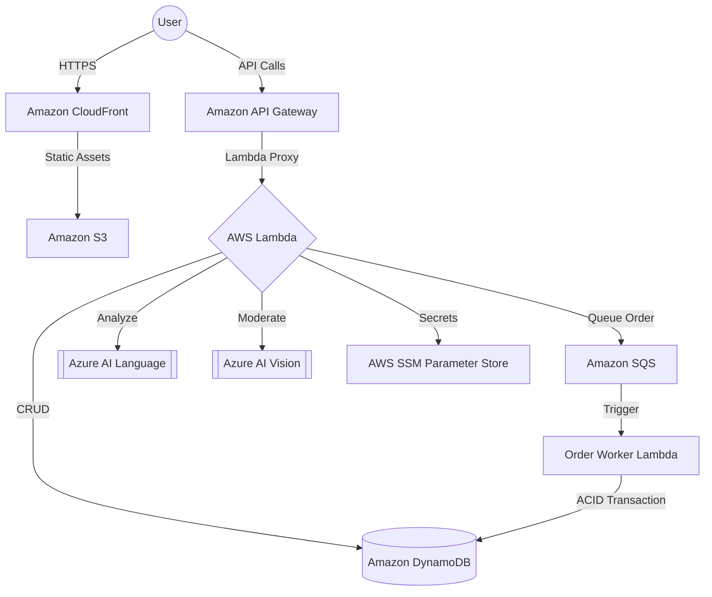

# ScholarKit Cloud 🎓☁️
### Serverless Multi-Cloud E-Commerce Infrastructure

ScholarKit Cloud is a modern, high-performance migration of a traditional DBMS project into a **Serverless Multi-Cloud Architecture**. Built on AWS and integrated with Azure AI, it demonstrates state-of-the-art cloud patterns including Single Table Design, Global Edge Delivery, and Event-Driven Processing.

---

## 🏗️ Cloud Architecture
The system utilizes a fully decoupled, event-driven architecture to ensure maximum scalability and cost-efficiency.



---

## 🚀 Key Cloud Features

### 1. **NoSQL Single Table Design (Amazon DynamoDB)**
- Migrated from MySQL 3NF to a high-performance **Single Table Design**.
- Uses **Overloaded GSI (Global Secondary Indexing)** to support complex queries (Orders, Schools, Products) in O(1) time.
- Implements **Atomic Transactions** using `TransactWriteItems` to maintain ACID compliance for order checkouts and stock consistency.

### 2. **Multi-Cloud AI Strategy**
- **Sentiment Analysis (Azure AI Language)**: Real-time analysis of user reviews to calculate sentiment scores (Positive, Negative, Mixed).
- **Image Moderation (Azure AI Vision)**: Automated moderation pipeline to ensure product uploads meet quality and compliance standards.
- **SSM Integration**: Cross-cloud API keys are secured in **AWS SSM Parameter Store** as `SecureString` types, retrieved at runtime with decryption.

### 3. **Global Edge Delivery (CloudFront)**
- **Amazon CloudFront** distribution with **Origin Access Control (OAC)** to lock down S3 storage.
- **SPA Routing Support**: Custom error responses map 403/404 errors to `index.html` with a 200 status, enabling client-side React Router navigation.
- **HTTPS Enforcement**: 100% SSL/TLS encryption for all traffic.

### 4. **Event-Driven Order Processing**
- **Amazon SQS** decouples the checkout API from the heavy lifting of inventory updates and email notifications.
- The `Order Worker` Lambda ensures reliable, asynchronous processing of the order queue, preventing API timeouts during peak traffic.

---

## 🛠️ Tech Stack
- **Frontend:** React 18, Tailwind CSS v4, Lucide Icons.
- **Compute:** AWS Lambda (Node.js 22.x).
- **Storage:** Amazon S3 (Frontend), Amazon DynamoDB (NoSQL Data).
- **API:** Amazon API Gateway (REST).
- **AI Services:** Azure AI Language, Azure AI Vision.
- **Security:** AWS IAM, AWS SSM, JWT Authentication.

---

## ⚙️ Deployment & Infrastructure

### 1. Deploying Backend (Lambda)
```bash
# Build and package all functions
bash aws/lambda/build.sh

# Update specific function (e.g., Sentiment Engine)
aws lambda update-function-code --function-name sk-create-review --zip-file fileb://aws/deploy/sk-create-review.zip
```

### 2. Deploying Edge (CloudFront)
```bash
# Initialize Global Edge Delivery and S3 Lockdown
bash scripts/deploy_cloudfront.sh
```

---

## 📊 Cloud Auditing & Monitoring
- **Amazon CloudWatch**: Detailed logging for sentiment analysis mapping and order worker performance.
- **Azure AI Metrics**: Monitoring sentiment classification confidence and API latency.

---

## 🔗 Live Production
**Production URL:** [https://d152bwhizx9644.cloudfront.net](https://d152bwhizx9644.cloudfront.net)

*Project developed for the Cloud Computing (C-234) Final Submission.*
